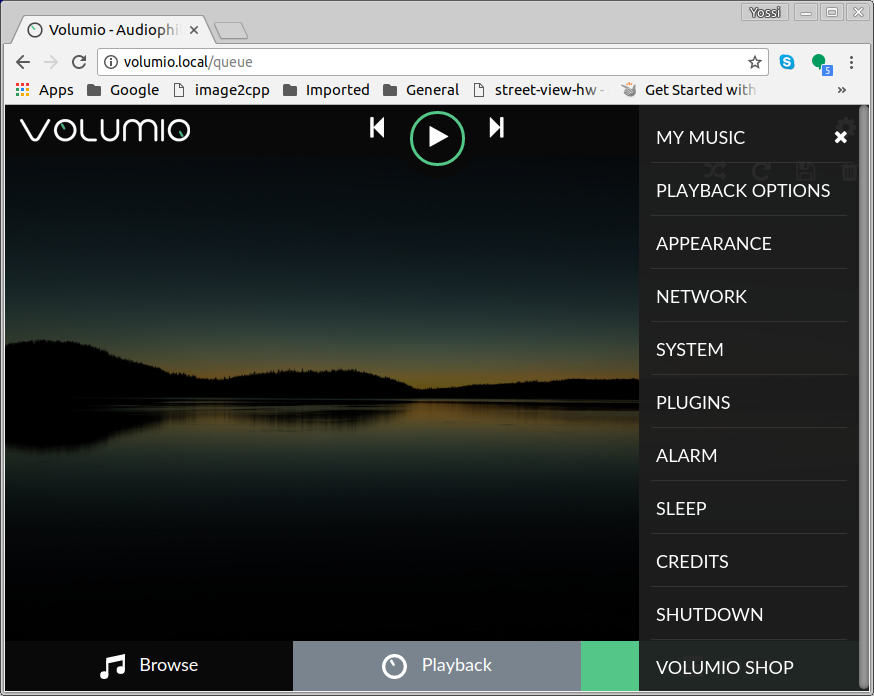
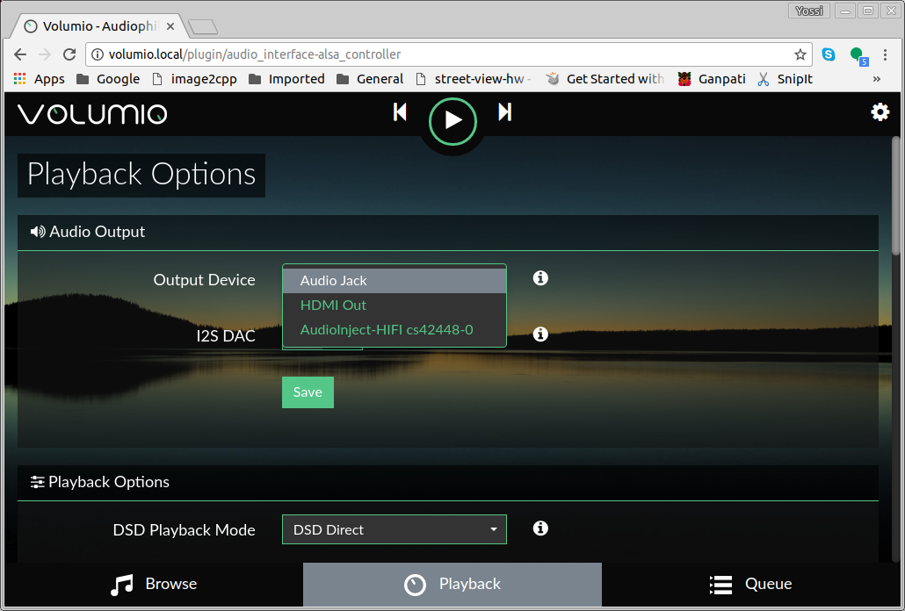

# Setting Volumio on RPi with Audio Injector Support

## Volumio image

**Pre-build image is [here](https://drive.google.com/open?id=0B6uAfFqeCQmvR3huNFNmTF9zbWM)**

Install system prereqs (on your Linux machine):

```
apt install git squashfs-tools kpartx multistrap qemu-user-static samba debootstrap parted dosfstools qemu binfmt-support qemu-utils
```
Clone the build repo on your local folder

```
cd
mkdir volumio
cd volumio
git clone https://github.com/volumio/Build Build
cd Build
```

Building the image as su

```
sudo su
```

if on Ubuntu, you may need to remove `$forceyes` from line 989 of `/usr/sbin/multistrap`

Building:

```
./build.sh -b arm -d pi -v 2.0 -l reponame
```

This will take ~20 minutes to finish

When it finishes, you'll end up with the following file in the `Build` folder:

```
$ ls -l Volumio2.0-2017-07-23-pi.img 
-rw-r--r-- 1 root root 2936012800 Jul 23 14:16 Volumio2.0-2017-07-23-pi.img
```

## Enabling Audio Injector 

Use Etcher (with GUI) or dd (no GUI) to write the image to an SD card

Insert SD card to your Pi and after few minutes (first time only) you'll get login prompt.
Use `volumio` as username and password

Update repos:

```
sudo apt-get update
```

Enable SSH

```
sudo cat '' > /boot/ssh
```

Enable Audio Injector driver

```
sudo echo 'dtoverlay=audioinjector-addons' >> /boot/config.txt
```

Reboot **twice**
```
reboot
```

## Testing Audio Injector

Check that Audio Injector is recognized:

```
dmesg | grep octo
```
```
[   11.914759] audioinjector-octo soc:sound: ASoC: CPU DAI (null) not registered - will retry
[   11.914776] audioinjector-octo soc:sound: snd_soc_register_card failed (-517)
[   13.477351] audioinjector-octo soc:sound: cs42448 <-> 3f203000.i2s mapping ok
```

Setup asoundrc by creating `/etc/asound.conf` and add the following:
```
pcm.!default {
#       type hw
#       card 0
        type plug
        slave.pcm "anyChannelCount"
}

ctl.!default {
        type hw
        card 0
}

pcm.anyChannelCount {
    type route
    slave.pcm "hw:0"
    slave.channels 8;
    ttable {
           0.0 1
           1.1 1
           2.2 1
           3.3 1
           4.4 1
           5.5 1
           6.6 1
           7.7 1
    }
}

ctl.anyChannelCount {
    type hw;
    card 0;
}
```
check that we can see the anychannelcount plugin like so :
```
$ aplay -L | grep -C 1 anyCh
default
anyChannelCount
sysdefault:CARD=ALSA
```

## Using USB WiFi Dongle

MOVE system may experience connectivity problems when internal RPi WiFi is used since the antenna is shielded. External USB WiFi can solve the issue.

In order to use a USB WiFi dongle as `wlan0`
add new line with `dtoverlay=pi3-disable-wifi` to `/boot/config.txt`


## Selecting AudioInjector Octo as the default sink

 Open Volumio on a browser (volumio.local), go to settings:
 
  
 
 Select **PLAYBACK OPTIONS** and select **AudioInjector** from output devices dropdown and press **SAVE**
 
  

## Setting MOVE system HotSpot 

* Go back to Volumio settings --> NETWORK and modify **Hotspot Name** from ```Volumio``` to ```MOVE-010001``` (Replace 010001 with the serial number).
* Modify **Hotspot Password** to ```timule-move```
* **SAVE**

## Connect MOVE to local network to proceed with installatoin

Use a browser to connect to volumio.local and go to NETWORK to select your preffered WiFi network

## Installing MOVE files

ssh into the system:

```
ssh volumio@volumio.local
```

Enable sudo by volumio user without password:

```
sudo visudo
```
Comment the line
```
volumio ALL=(ALL) NOPASSWD: /sbin/poweroff,/sbin/shutdown,/sbin/reboot,/sbin/halt,/bin/systemctl,/u$
```
Add this line at the end:
```
volumio ALL=(ALL) NOPASSWD: ALL
```
Save and exit

### Get the files from GitHub

```
cd ~
git clone https://github.com/yossichay/TRL.git
```

### Installing MOVE Hardware control program

MOVE Hardware control program is loaded on startup and runs in the background, updating OLED, LEDs, GPIOs and power management.

```
sudo apt-get install build-essential git-core libi2c-dev i2c-tools lm-sensors libmpdclient-dev unzip
```

Add the two following lines into the file ```/etc/modules```

```
i2c-bcm2708
i2c-dev
```

**Installation of SSD1306 Driver:**

```
cd TRL
cd timule-hw-ctl/ArduiPi_SSD1306/
sudo make
cd ../src
make
sudo mkdir /volumio/hw
cp oled /volumio/hw
cd ..
sudo cp move-hw.sh /etc/init.d 
```

Test the OLED:
```
cd /volumio/hw
sudo ./oled -o 3
```
Setup ```oled``` to run at startup:


```
cd /etc/init.d
sudo chmod +x move-hw.sh
sudo update-rc.d move-hw.sh defaults
``` 

Don't worry about the warning

**Password is required for zip files**

### Copy backend apps


```
cd ~/TRL
unzip vol-timule-volumio.zip
cd vol-timule-volumio/volumio-root/volumio
sudo systemctl stop volumio
sudo cp -rf * /volumio
```
### Copy the media and playlists

Get it from Google Drive
Copy media files to ```/data/INTERNAL```
copy playlists to ```/data/playlist```


